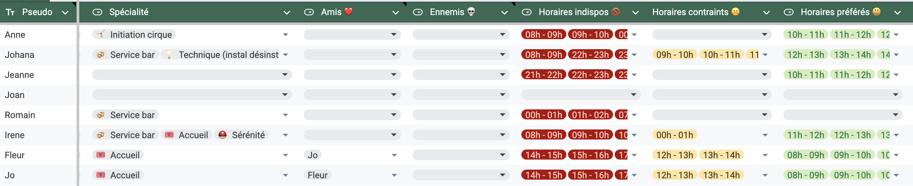
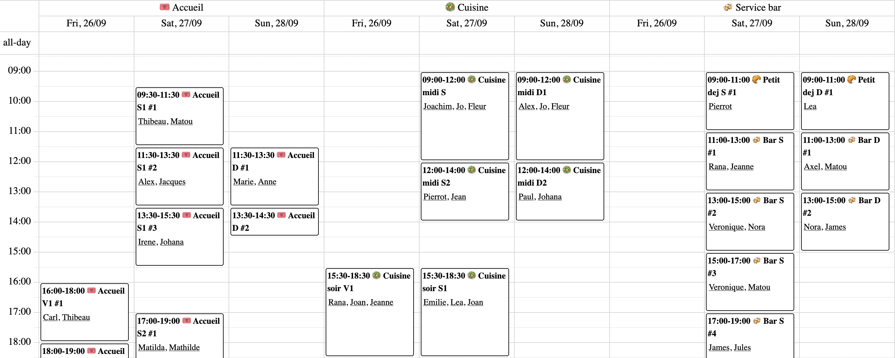

# A solver for festival volunteers planning

> [!NOTE]
> A lot of the project is currently written in French, including the main Python script, a translation to English will be done when writing the definitive version of each components. Documentation will be available in French and English.

## Demo use case: Super Brassac 2025

The name of volunteers has been changed and personal information removed from the file.

- [Spreadsheet used to fill tasks and volunteers informations](https://docs.google.com/spreadsheets/d/1VkJOyRG-ajtmhvy5klsw7VHxNVBuH415ORll_ytWlXw/edit?gid=1948919888#gid=1948919888)

- [Resulting planning](https://team-afj.github.io/toubenev/#user=all)

## Project (de)organization

- `lbc24.py` The heart of this project: a python script that builds a model and runs or-tools' CP-SAT to find an optimal solution. it is written in a mostly declarative fashion, in French, with extensive comments describing all of the rules. It also include a bunch of dirty output functions to ical, json, etc.
- `web2` Contains the latest experimental display of the results. It is written with js-of-ocaml and brr-lwd. It binds the [vkurko/calendar](https://github.com/vkurko/calendar/) library. Used for [the demo](https://team-afj.github.io/toubenev/#user=all). It is still an early work in progress.
- ~~`web`~~  the first iteration on the planning display, using typescript and vkurko/calendar. Now obsolete and will be removed.
- `server` the future server code for the end-to-end tool
- `client` the future client code for the end-to-end tool
- `model` the interface between the ocaml server and the python script building
  the model.
- `shared/*` types and values that can be shared between the server and client code.
- `www` static files for the future server
